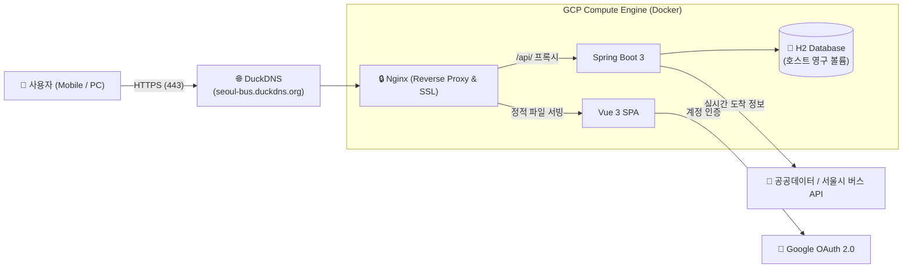

# 🚌 Bus Tracker

사용이 쉬운 실시간 서울 버스 도착 정보 조회 서비스

🔗 **서비스 링크:** [https://seoul-bus.duckdns.org](https://seoul-bus.duckdns.org)


---

- **주요 사용 기술**
    - Google Antigravity, AI Model(Gemini, Claude Sonnet)
    - Frontend: Vue 3
    - Backend: Java 21, Spring Boot 3
    - Database: H2 (MySQL Mode)
    - Infra & DevOps: GCP Compute Engine, Docker & Docker Compose, Nginx, Let's Encrypt (HTTPS), DuckDNS
    - CI/CD: GitHub Actions

---

## 🏗️ 시스템 아키텍처



---

## ✨ 주요 기능

1. **실시간 버스 도착 정보:** 정류장 검색, 노선별 도착 예정 시간 및 남은 정류장 실시간 확인 (15초 자동 새로고침)
2. **다기기 즐겨찾기 동기화:** 
   * **게스트 모드:** 로그인 없이 기기 고유 ID로 즉시 즐겨찾기 저장
   * **Google 계정 연동:** 로그인 시 다른 기기에서도 동일한 즐겨찾기 유지 및 기존 게스트 데이터 자동 병합
3. **반응형 UI:** 모바일 및 데스크톱 환경에 최적화된 반응형 카드 뷰
4. **HTTPS 보안 적용:** Let's Encrypt 무료 SSL 인증서 적용 및 자동 갱신 구성

---

## 🚀 배포 파이프라인

`main` 브랜치에 코드를 푸시하면 **GitHub Actions**를 통해 자동으로 배포됩니다:

```
[Git Push] ➔ [Gradle 빌드 & Docker 이미지 생성] ➔ [Docker Hub 푸시] ➔ [GCP VM SSH 접속] ➔ [SSL 확인 & 컨테이너 무중단 갱신]
```
